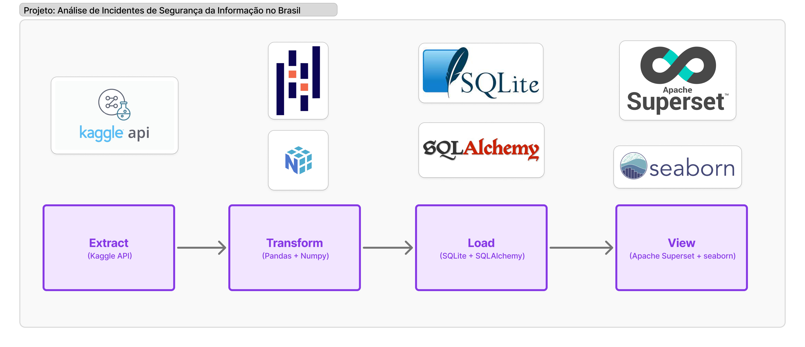
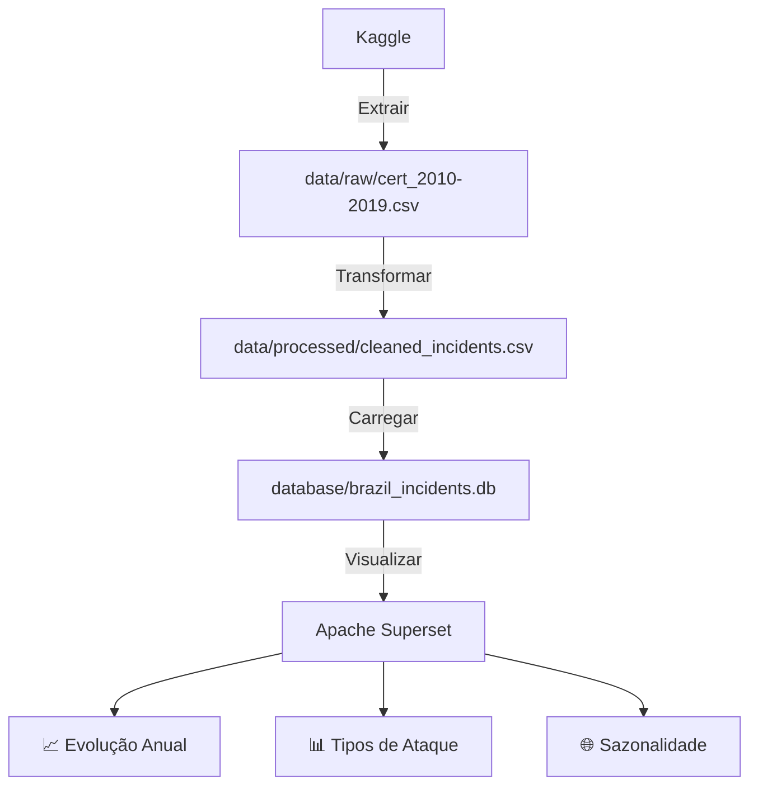

# Projeto: Análise de Incidentes de Segurança da Informação no Brasil 🌐🔐



Análise de padrões e tendências de incidentes de segurança da informação no Brasil (2010-2019) usando dados do CERT.br via Kaggle API.

## 🔧 Ferramentas Utilizadas
- **Extração**: Kaggle API
- **Processamento**: Python (Pandas, NumPy)
- **Armazenamento**: SQLite
- **Visualização**: Apache Superset + Seaborn

## 📂 Estrutura do Repositório
```
.
├── data/
│ ├── raw/incidentes-seguranca-brasil.csv # Dados baixados via API
│ └── processed/cleaned_incidents.csv # Dados tratados
├── database/
│ └── brazil_incidents.db # Banco SQLite
├── notebooks/
│ └── security_analysis.ipynb # Análise exploratória
├── scripts/
│ ├── kaggle_download.py # Download via API
│ ├── etl.py # Pipeline de processamento
│ └── superset_config/
│ ├── dashboard_export.json # Config do dashboard
│ └── import_dashboard.py # Script de import
├── visualizations/
│ ├── dashboards/
│ │ └── security_dashboard.json # Template Superset
│ └── plots/ # Imagens geradas
├── requirements.txt
├── .env # Armazena API key
└── README.md
```

## 🌲 Estrutura do Pipeline



## ⚙️ Pré-requisitos
1. Conta no [Kaggle](https://www.kaggle.com/)
2. Obter API Key (Settings → Create New API Token)
3. Python 3.10+

## 🚀 Execução do Projeto

### 1. Configurar ambiente
```bash
# Cria o ambiente virtual
python -m venv venv

# Ativa o venv (Linux/Mac)
source venv/bin/activate

# Ou no Windows:
.\venv\Scripts\activate

pip install -r requirements.txt --ignore-installed --no-deps --no-build-isolation --force-reinstall

# Confirme as libs baixadas
pip list

```
## 2. 2. Configurar API do Kaggle

```bash
# Crie um arquivo .env na raiz do projeto com:
KAGGLE_USERNAME=seu_usuario
KAGGLE_KEY=sua_api_key
```

## 2. Baixar dados do Kaggle

```bash
python scripts/kaggle_download.py
```

## 3. Processar dados

```bash
python scripts/etl.py
```

## 4. Visualização (Apache Superset)

```bash
superset run -p 8080

# Acesse: http://localhost:8088
```

## 📊 Principais Visualizações

**Visualização 1**  


**Visualização 2**  


**Visualização 3**  


## 🔍 Principais Insights

### 1. Tendência Anual de Incidentes
  

- **Crescimento de 530%** entre 2010-2019  
- **Pico histórico em 2017** (Julho: 257.618 incidentes)  

---

### 2. Tipos de Ataque Dominantes
```python
# Código para análise:
df.groupby('Ano')[['Scan', 'DOS', 'Worm']].sum().plot(kind='bar')
```

| Tipo de Ataque | Percentual | Evolução Histórica         |
|----------------|------------|----------------------------|
| **Scan**       | 58%        | Técnica mais comum         |
| **DOS**        | 23%        | Cresceu 400x desde 2013    |
| **Fraude**     | -          | Aumento de 1200% na década |

---

### 3. Padrões Mensais
  

- **Meses críticos**: Junho-Novembro  
- **Período mais seguro**: Janeiro (-30% vs média)  

---

### 4. Mudanças na Natureza dos Ataques
**2012-2015**:  
- Dominância de Scans  

**2016-2019**:  
- Explosão de ataques DOS  
- Surgimento de novas ameaças (Web, Fraude)  
