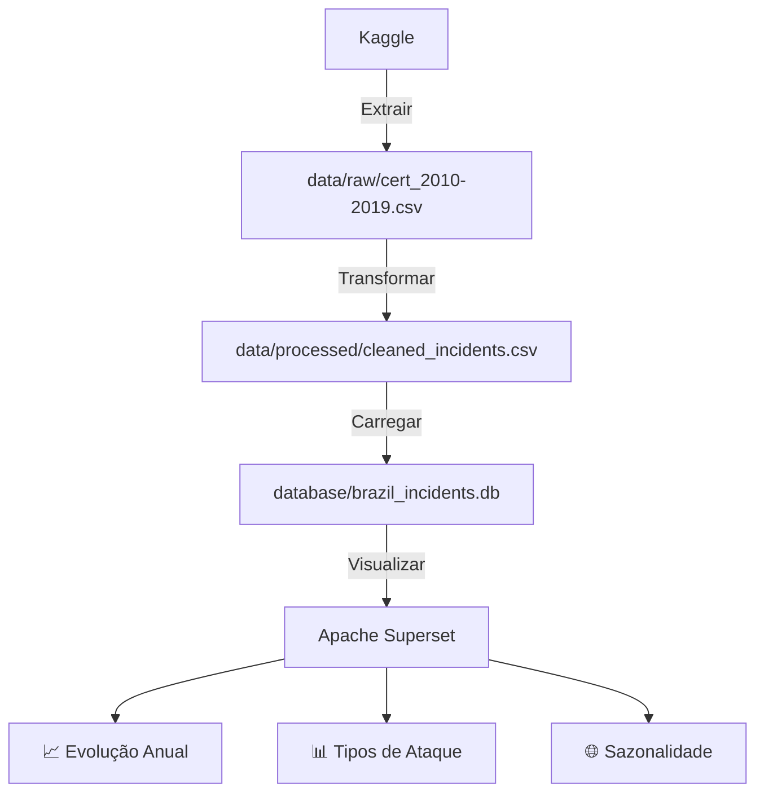

# Projeto: Análise de Incidentes de Segurança da Informação no Brasil 🌐🔐


Análise de padrões e tendências de incidentes de segurança da informação no Brasil (2010-2019) usando dados do CERT.br via Kaggle API.

## 🔧 Ferramentas Utilizadas
- **Extração**: Kaggle API
- **Processamento**: Python (Pandas + scikit-learn)
- **Armazenamento**: SQLite
- **Visualização**: Seaborn + Matplotlib

## 📂 Estrutura do Repositório
```

├── data/                  
│   ├── raw/                  
│   │   └── incidentes-seguranca-brasil.csv # Dados brutos
│   └── processed/            
│       └── cleaned_incidents.csv # Dados tratados
├── database/
│   └── brazil_incidents.db   # Banco de dados SQLite
├── notebooks/
│   └── security_analysis.ipynb  # Análise exploratória
├── scripts/
│   ├── kaggle_download.py    # Download via API
│   └── etl.py                # Pipeline de processamento
├── requirements.txt          # Dependências
├── .env                      # Variáveis de ambiente
├── README.md                 # Documentação
```

## 🌲 Estrutura do Pipeline



## ⚙️ Pré-requisitos
1. Conta no [Kaggle](https://www.kaggle.com/)
2. Obter API Key (Settings → Create New API Token)
3. Python 3.10+

## 🚀 Execução do Projeto

### 1. Configurar ambiente

```bash
# Cria o ambiente virtual
python -m venv venv

# Ativa o venv (Linux/Mac)
source venv/bin/activate

# Ou no Windows:
.\venv\Scripts\activate

pip install -r requirements.txt

# Confirme as libs baixadas
pip list


```
## 2. Configurar API do Kaggle

```bash
# Crie um arquivo .env na raiz do projeto com:
KAGGLE_USERNAME=seu_usuario
KAGGLE_KEY=sua_api_key
```

## 3. Baixar dados do Kaggle

```bash
python scripts/kaggle_download.py
```

## 4. Processar dados

```bash
python scripts/etl.py
```

## 5. Visualização (Seaborn)

### Abra o Jupyter Notebook:
```bash
# Navegue até:
notebooks/security_analysis.ipynb

# Execute as células sequencialmente
```

## 🔍 Principais Insights

### 1. Tendência Anual de Incidentes
.png)   

- **Crescimento de 418%** entre 2010 (149.418 incidentes) e 2019 (773.964 incidentes)  
- **Picos históricos**:  
  - 2014: 2º semestre com 134k-214k incidentes/mês  
  - 2017: Julho com 257.618 incidentes (máximo absoluto)  
- **Dado crítico**: 2019 teve o 2º maior volume da década   

---

### 2. Dominância de Tipos de Ataque
  

| Tipo de Ataque | Participação | Destaque Histórico              |
|----------------|--------------|----------------------------------|
| **Scan**       | 47.7%        | Base constante, mas em declínio  |
| **DOS**        | 10.8%        | Cresceu 557.500% na década       |
| **Fraude**     | 9.8%         | Tendência ascendente (+8%/ano)   |

---

### 3. Sazonalidade e Padrões Mensais
  

- **Junho**: Mês mais crítico em 3 dos 10 anos analisados 
- **Q4**: Aumento médio de 22% nos incidentes
- **Anomalia**: Dezembro/2014 com 58k incidentes vs média de 42k

---

### 4. Evolução dos Top 3 Ataques
 

**Tendências chave**:  
- **DOS**: Disparado em 2017-2019 (345k incidentes em 2019)
- **Scan**: Queda de 60% para 47% do total (2010→2019)
- **Fraude**: Crescimento linear desde 2015

---

### 5. Correlações entre Ameaças
 

**Relações significativas:**:  
- **DOS ↔ Worm** (0.45): Indica ataques combinados
- **Scan ↔ Invasao** (0.22): Fase de reconhecimento → exploração
- **Fraude ⊣ DOS** (-0.38): Grupos especializados distintos

---

### 6. Mudanças na Composição
) 

**Mudanças estruturais:**:  
- **2010-2015:** Scans >70% dos incidentes
- **2016-2019:**
        DOS salta para 34.7%
        Novos vetores (Web, Fraude) ganham relevância